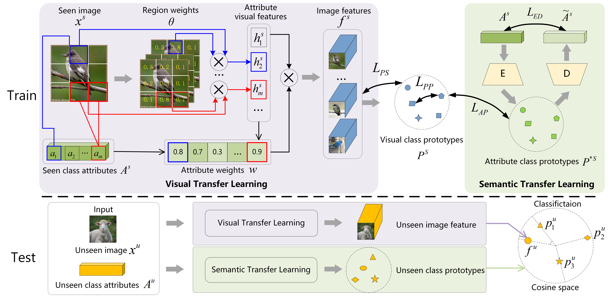

# Zero-Shot Learning  with Visual-Semantic Mutual Reinforcement for Image Recognition

## Overview

This repository contains the implementation of Zero-Shot Learning with Visual-Semantic Mutual Reinforcement for Image Recognition.

In this work, we develop the mutual reinforcement of visuals and semantics, which focuses more on the inconsistent transferable representations to achieve the complementation of two modals.



## Prerequisites

To install all the dependency packages, please run:

```
pip install -r requirements.txt
```

---

## Data Preparation

Please download and extract information into the `./data folder`. We include details about download links as well as what are they used for in each folder within `./data folder`.

We have included the result file by default in the repository. Similarly, we have also included the attribute semantics from GloVe model for all datasets which are computed by:

```
python ./extract_feature/extract_attribute_w2v_AWA2.py					#create ./w2v/AWA2_attribute.pkl
python ./extract_feature/extract_attribute_w2v_CUB.py					#create ./w2v/CUB_attribute.pkl
python ./extract_feature/extract_attribute_w2v_SUN.py					#create ./w2v/SUN_attribute.pkl
```

3) Please run feature extraction scripts in `./extract_feature` folder to extract features from the last convolution layers of ResNet as region features for attention mechanism:

```
python ./extract_feature/extract_feature_map_ResNet_101_AWA2.py	
python ./extract_feature/extract_feature_map_ResNet_101_CUB.py						
python ./extract_feature/extract_feature_map_ResNet_101_SUN.py						
```

These scripts create hdf5 files which contain image features and data splits for training and evaluation.

---

## Training and Evaluation

1) We provide a general model for all three datasets in core model DAZLE.py.
1) Please run AWA2_ours.py and CUB50_ours.py to train our core model.

## Pretrained Models

Since the training process is not resource-intensive, most experiments can be produced within 30mins.

+ If you need the pretrained models, please reach out to me via zhangyh@hfut.edu.cn

## Conclusion

If this code is helpful for your research, we would appreciate if you cite the work.
